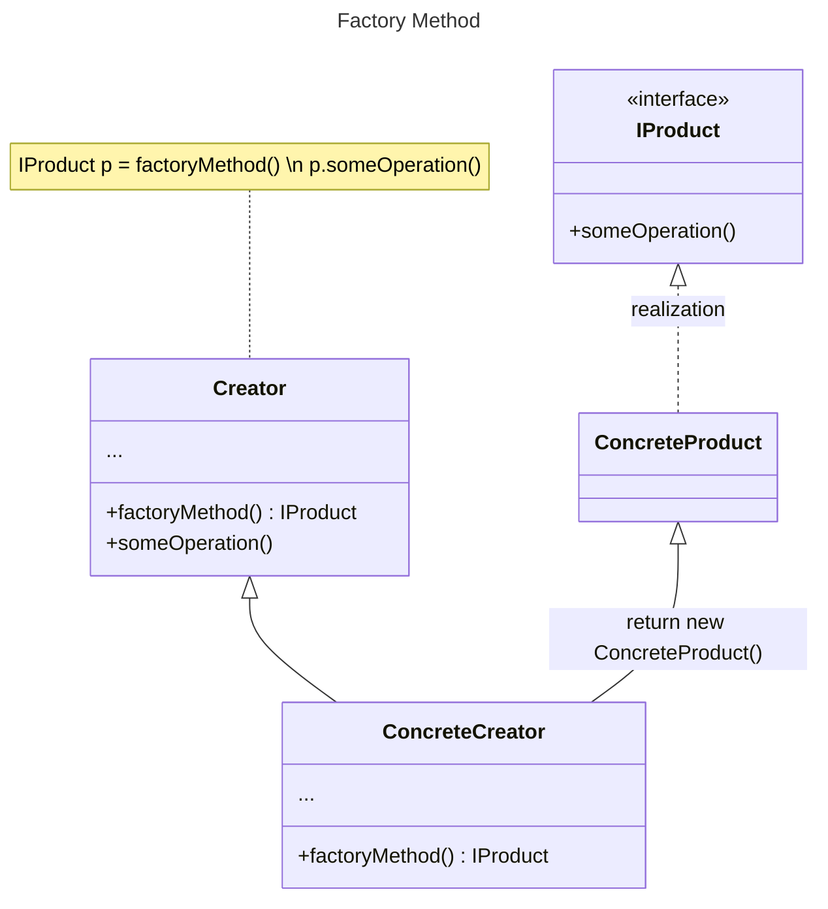
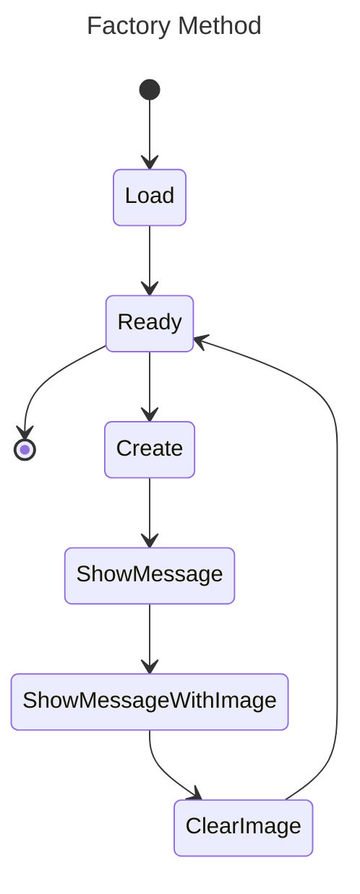

# Factory-Method
Фабричний метод – це породжувальний патерн проєктування, який визначає загальний інтерфейс для створення об'єктів у батьківському класі, дозволяючи підкласам змінювати тип створюваних екземплярів.

Цей патерн реалізує принцип Open-Closed із SOLID: клас-Творець відкритий для розширення (додавання нових продуктів), але закритий для модифікації.

### Застосування фабричного методу:
- **Гнучкість** – дозволяє додавати нові класи без зміни наявного коду.
- **Відокремлення клієнтського коду** – клієнт не створює об’єкти безпосередньо, а використовує фабричний метод, що зменшує залежність від конкретних класів.
- **Розширюваність фреймворків і бібліотек** – підкласи можуть визначати власну логіку створення об’єктів, зберігаючи загальну структуру.
- **Економія ресурсів** – фабричний метод дозволяє керувати залежностями, полегшуючи заміну чи конфігурацію без зміни основного коду.

##### Class Diagram Factory Method:

##### State Diagram Factory Method:

**Основні структурні елементи:**  

- **Product** – загальний інтерфейс для об'єктів, які створюються творцем і його підкласами.  
- **ConcreteProduct** – конкретні реалізації продуктів, які мають спільний інтерфейс, але різні способи реалізації.  
- **Creator** – інтерфейс або абстрактний клас, що містить фабричний метод, який створює об'єкти продуктів. Важливо, щоб повернений тип відповідав загальному інтерфейсу продуктів.  
- **ConcreteCreator** – клас, що реалізує фабричний метод, визначаючи, який саме конкретний продукт буде створено.  

На діаграмі стану можна побачити конкретну реалізацію патерну **Factory Method**.
