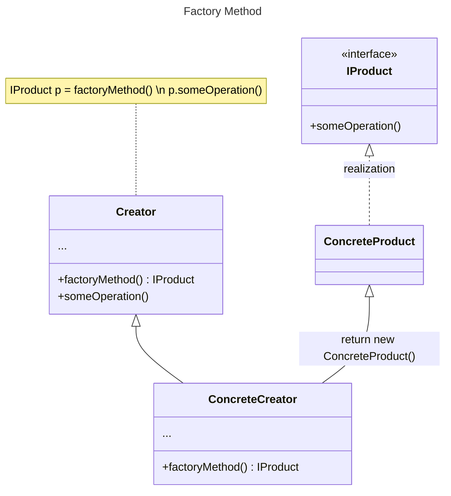
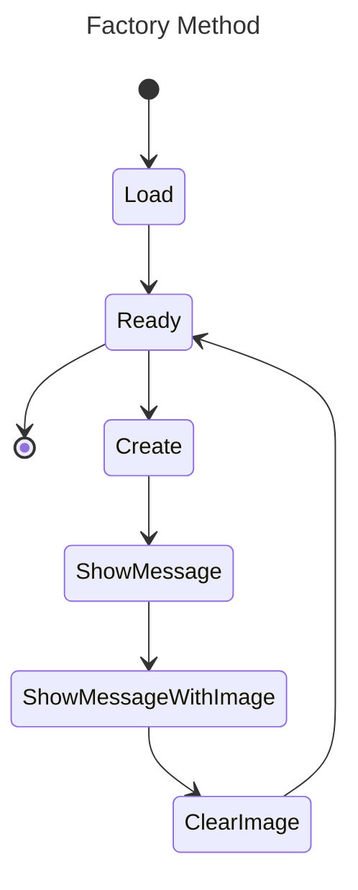

# Factory-Method
Фабричний метод – це породжувальний патерн проєктування, який визначає загальний інтерфейс для створення об'єктів у батьківському класі, дозволяючи підкласам змінювати тип створюваних екземплярів.

Цей патерн реалізує принцип Open-Closed із SOLID: клас-Творець відкритий для розширення (додавання нових продуктів), але закритий для модифікації.

### Застосування фабричного методу:
- **Гнучкість** – дозволяє додавати нові класи без зміни наявного коду.
- **Відокремлення клієнтського коду** – клієнт не створює об’єкти безпосередньо, а використовує фабричний метод, що зменшує залежність від конкретних класів.
- **Розширюваність фреймворків і бібліотек** – підкласи можуть визначати власну логіку створення об’єктів, зберігаючи загальну структуру.
- **Економія ресурсів** – фабричний метод дозволяє керувати залежностями, полегшуючи заміну чи конфігурацію без зміни основного коду.

##### Class Diagram Factory Method:

##### State Diagram Factory Method:

### Опис основних структурних елементів :
- **Product** - загальний інтерфейс об’єктів, які може створювати творець та його підкласи;
- **ConcreteProduct** містить код різних продуктів. Відрізнятимуться реалізацією, але інтерфейс у них буде спільним;
- **Creator** (інтерфейс або абстрактний клас) оголошує фабричний метод, який має повертати нові об’єкти продуктів. Важливо, щоб тип результату цього методу співпадав із загальним інтерфейсом продуктів.
- **ConcreteCreator** по-своєму реалізує фабричний метод, виробляючи ті чи інші конкретні продукти.
##### На діаграмі стану можна побачити конкретну реалізацію по шаблону Factory method.
